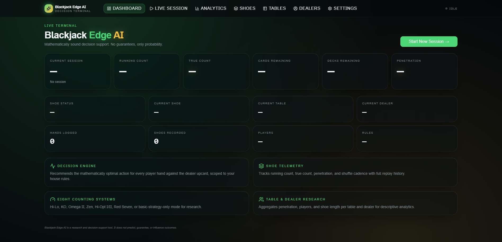
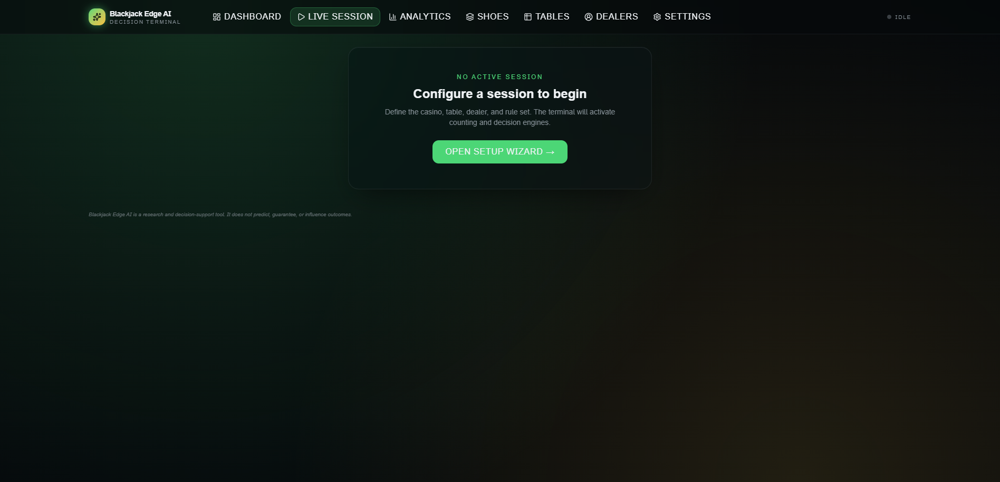
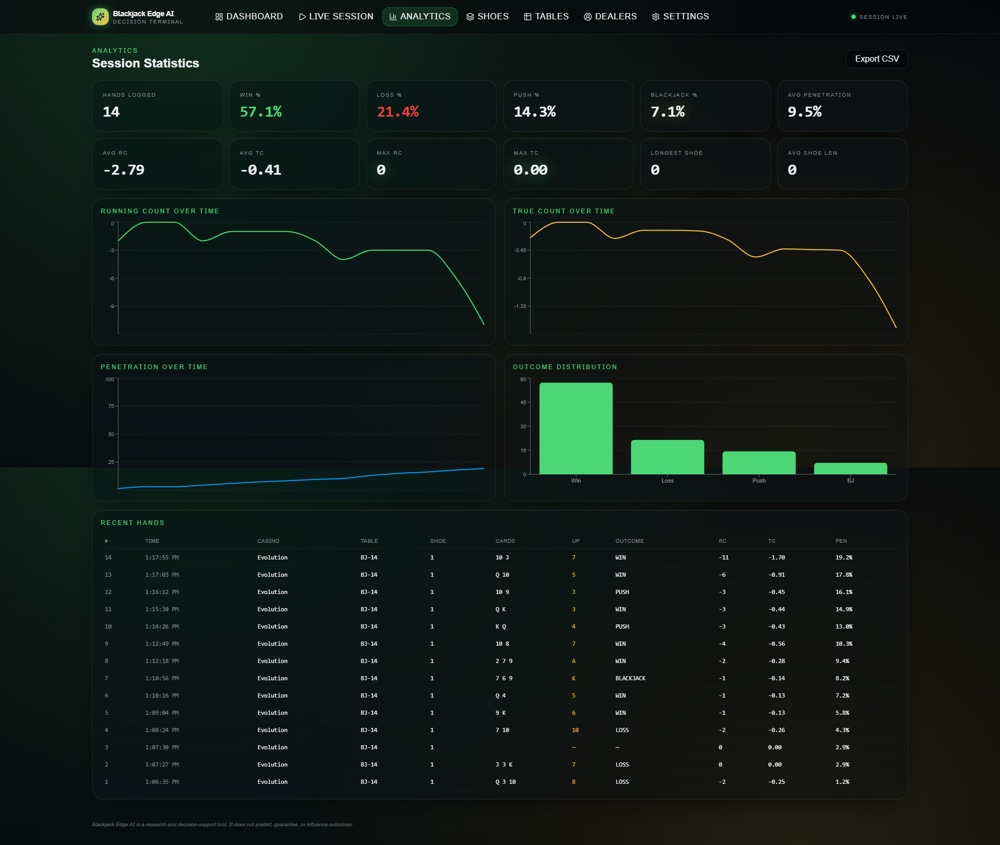
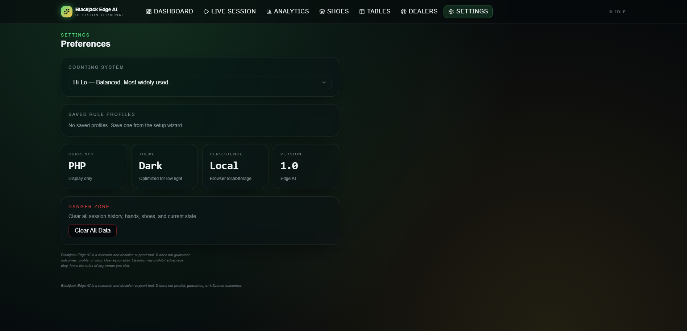

# ♠️ Blackjack Decision Engine

A modern **Blackjack Analytics & Decision Engine** built for players, researchers, and software developers interested in blackjack mathematics, statistics, and decision analysis.

> **Educational • Analytical • Research Focused**

## 📸 Screenshots

### Dashboard



### Live Session



### Analytics



### Settings



---

# 📖 Overview

Blackjack Decision Engine is a modern blackjack companion designed to assist with **strategy analysis**, **session tracking**, and **statistical visualization**.

Unlike applications that claim to guarantee profits or predict future cards, this project focuses on providing objective, mathematics-based decision support using configurable blackjack rules and established probability principles.

Whether you're studying blackjack strategy, experimenting with different counting systems, or simply logging your sessions, the application provides an intuitive interface for collecting and analyzing gameplay data.

---

# Features

## Decision Engine

Evaluate the current hand and receive recommendations based on:

- Hit
- Stand
- Double
- Split
- Surrender

Recommendations adapt to the configured blackjack rules and available game information.

---

## ♣ Multiple Counting Systems

Supported systems include:

- Hi-Lo
- KO
- Omega II
- Zen Count
- Hi-Opt I
- Hi-Opt II
- Red Seven
- Basic Strategy Only

---

## Live Session Tracking

Track blackjack sessions in real time.

Monitor:

- Running Count
- True Count
- Shoe Progress
- Cards Remaining
- Decks Remaining
- Penetration
- Session Duration
- Current Dealer
- Current Table
- Hands Played

---

## Shoe Tracking

Track every blackjack shoe.

Features include:

- Shoe Number
- Running Count History
- True Count History
- Shuffle Tracking
- Penetration
- Cards Dealt

---

## Analytics Dashboard

Visualize historical gameplay with interactive charts.

Includes:

- Running Count Timeline
- True Count Timeline
- Win / Loss Distribution
- Dealer Bust Percentage
- Session Statistics
- Average Penetration
- Highest Observed Count

---

## ⚙ Rule Configuration

Customize the engine to match different blackjack variants.

Supported options:

- Number of Decks
- Dealer Stands on Soft 17 (S17)
- Dealer Hits Soft 17 (H17)
- Blackjack Payout
- Double Rules
- Split Rules
- Resplit Rules
- Surrender Rules
- Maximum Players

---

# Getting Started

## Clone the repository

```bash
git clone https://github.com/YOUR_USERNAME/blackjack-decision-engine.git
```

## Install dependencies

```bash
npm install
```

## Run the development server

```bash
npm run dev
```

Open your browser and navigate to the local URL displayed in the terminal.

---

# How to Use

## 1. Configure the Table

Before starting a session:

- Select the blackjack rules
- Configure the number of decks
- Choose the counting system
- Confirm whether the dealer stands or hits on Soft 17
- Set available player options such as surrender or double after split

Accurate configuration helps ensure the engine analyzes the game using the correct rule set.

---

## 2. Start a New Shoe

For the most accurate card-counting statistics, begin tracking from the start of a new shoe whenever possible.

If joining a table mid-shoe, the application can still provide rule-based strategy recommendations, but count-based analytics may not be fully accurate until a new shoe begins.

---

## 3. Enter Cards

Use the fast card-entry keypad to record visible cards as they are dealt.

The application automatically updates:

- Running Count
- True Count (when applicable)
- Cards Remaining
- Estimated Decks Remaining
- Penetration
- Session Statistics

---

## 4. Enter Your Hand

Input:

- Your cards
- Dealer upcard

The Decision Engine evaluates all legal actions and recommends the mathematically preferred option based on the configured rules and available information.

---

## 5. Continue Tracking

Continue logging each hand until the shoe ends.

When the dealer shuffles, begin a new shoe to reset the count and continue tracking accurately.

---

# Technology Stack

- React
- TypeScript
- Next.js
- Tailwind CSS
- shadcn/ui
- Framer Motion
- Recharts

---

# Roadmap

## Current

- ✅ Decision Engine
- ✅ Session Tracking
- ✅ Shoe Tracking
- ✅ Statistics Dashboard
- ✅ Multiple Counting Systems
- ✅ Rule Configuration

## Planned

- Monte Carlo Simulation
- OCR-assisted Card Recognition
- Computer Vision Experiments
- Advanced Statistical Reports
- Cloud Synchronization
- Mobile Companion Application

---

# Disclaimer

> **This software does NOT guarantee winning outcomes, profits, or a positive expected value.**

Blackjack is a game of chance involving real financial risk. Even mathematically optimal decisions can result in losing sessions due to normal statistical variance.

This application is intended solely for educational, analytical, and research purposes. Recommendations are generated using the configured game rules and the information entered by the user. They should not be interpreted as guarantees of success or future results.

**Play responsibly. Gamble only with money you can afford to lose. Use this software at your own risk.**

---

# License

This project is licensed under the MIT License.

```

```
